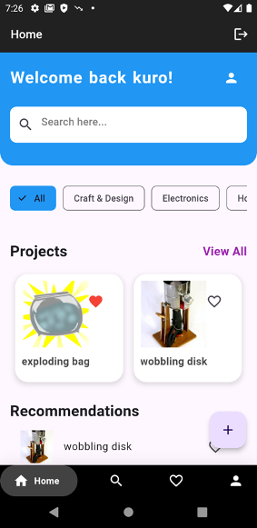
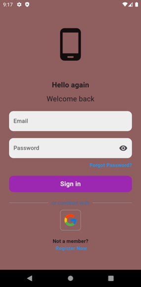
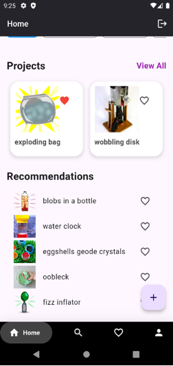
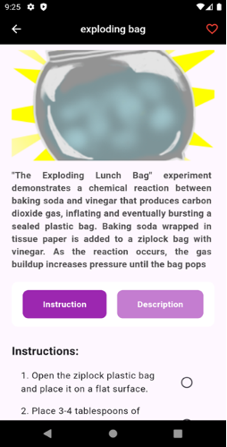
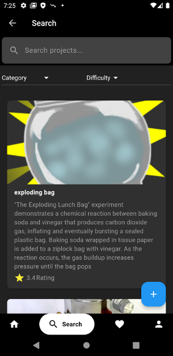

# Crafting Application 🛠️

Welcome to the **Crafting Application**! This project is designed to help crafters, DIY enthusiasts, and creative minds organize, plan, and execute their crafting projects with ease. Whether you're into woodworking, knitting, painting, or any other craft, this application provides the tools you need to bring your ideas to life.

---

## Features ✨

- **Step-by-Step Guides**: Break down projects into manageable steps with instructions. 📝
- **Inspiration Gallery**: Browse through a gallery of completed projects for inspiration. 🎨
- **User Feedback**: Share your thoughts and suggestions to help improve the app. 💬
- **Wishlist**: Save your favorite projects and materials for future reference. ❤️
- **Recommendations**: Get personalized project and material recommendations based on your preferences. 🎯
- **Edit Profile**: Customize your profile with a photo, bio, and preferences. 👤
- **Search**: Easily find projects, materials, or guides with a powerful search feature. 🔍

---

## Screenshots 📸
*Home Screen - Overview of your active projects.*

      

*Project Details - Step-by-step instructions and material list.*

*Inspiration Gallery - Browse projects for ideas.*

---

## Technologies Used
### Prerequisites
- Flutter SDK (version 3.0 or higher)
- Dart (version 2.18 or higher)
- Android Studio (for mobile development)
- Firebase account (for backend and authentication)
- Python 
